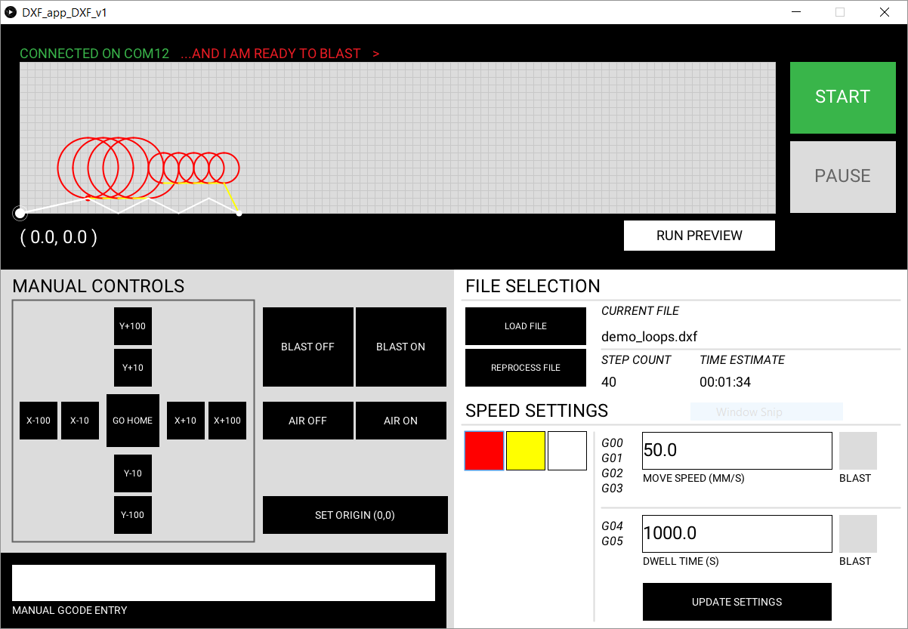
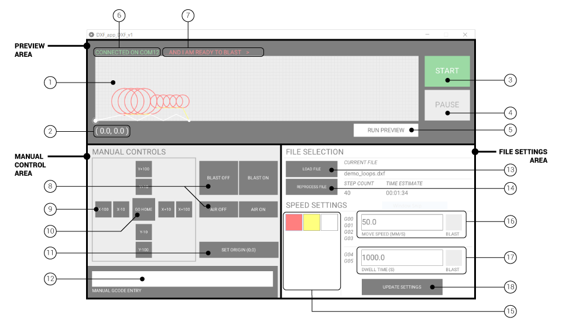

# Blast-bot Controller Software
_Designed & built by The Living, an Autodesk Studio. 2016._

1. #### [User Interface](#user-interface)
2. #### [Typical Workflow](#typical-workflow)
3. #### [Manual GCODE Commands](#manual-gcode-commands)

***
# [User Interface](#user-interface)

### Preview Area
1. __Preview Window__
2. __Current Position__ Displays nozzle's current (x, y) position, in mm.
3. __Start/Stop__ (While not running) Loads commands into queue and begins blasting process. (While running) Stops blasting process and clears queue of commands - machine will complete current command before stopping.
4. __Pause/Unpause__ (While running) Stops blasting process, but leaves commands in the queue - machine will complete current command before stopping. (While paused) Resumes blasting process.
5. __Run Preview/End Preview__ Starts previewing commands in Preview Window (1) - blasting commands will be shows in red and non-blasting moves in blue.
6. __Connection Status__ Will indicate connection to robot controller in green. If status reads "Not Connected" in red, try re-plugging in the USB cord to the controller.
7. __Recieved Commands__ Displays RX messages from Controller

### MANUAL CONTROL Area
8. __Blast / Air Control__ Manually start/stop blast media and clearing air flow or clearing air flow only.
9. __Manual Positioning__ Move nozzle up/down/left/right in 10 or 100mm increments
10. __Go Home__ Moves nozzle back to home (0,0) position
11. __Set Origin__ Sets current nozzle position as (0,0)
12. __Manual Command Entry__ Allows GCODE commands to be entered and issued manually. Hit ENTER to submit command. Robot will execute manual commands immediately.

### FILE SETTINGS Area
13. __Load File__ Opens a dialogue to select DXF file to run
14. __Process/Reprocess File__ Parses DXF file to produce GCODE commands using current speed settings. Reprocess file if speed settings are changed to update GCODE and time estimates.
15. __Color Settings__ Colors in DXF file - colors will update when a file is loaded. Click on color to select and update settings. Selected color will be highlighted with blue border.
16. __Move Settings__ For selected color, sets movement speed and toggles blast stream for lines and arcs (G00/G01/G02/G03 commands)
17. __Dwell Settings__ For selected color, set dwell/pause time and toggles blast stream for point geometry (G04/G05 commands)
18. __Update Settings__ Records updated settings for selected color.

---
# [Typical Workflow](#typical-workflow)
1. Click `Load File` button to select DXF file to blast
2. Modify color settings by selecting a color, entering speed / dwell time, and toggling blasting. Hit `Update Settings` after each color to log settings.
3. Click `Process File` to convert DXF to GCODE and create time estimate. If you need to modify color settings, `Reprocess File` to update GCODE and time estimate.
4. Click `Run Preview` to confirm blast sequence. Blast commands will be displayed in red, and non-blasting commands will be displayed in blue. Click `End Preview` to exit preview mode.
5. Manually position blast nozzle at desired origin using manual controls. Click `Set Origin` to update the machine's origin.
6. Click `Start` to begin machine operation. Click `Pause` to temporarily halt the machine operation. Click `Stop` if you need to cancel the operation.

---
# [Manual GCODE Commands](#manual-gcode-commands)

_Commands are case-sensitive_

`G00 / G01` __MOVE Command__
- G00: Move without blasting
- G01: Move with blasting
- X: Destination X coordinate (in mm)
- Y: Destination Y coordinate (in mm)
- F: Feed rate (in mm/s)
- Example: `G01 X55.5 Y125.25 F25.0`

`G02 / G03` __ARC Command__
- G02: Move in a clockwise arc (with blasting)
- G03: Move in a counter-clockwise arc (with blasting)
- I: Arc center X coordinate (in mm)
- J: Arc center Y coordinate (in mm)
- X: Destination X coordinate (in mm)
- Y: Destination Y coordinate (in mm)
- F: Feed rate (in mm/s)
- Example: `G02 I10.0 J0.0 X20.0 Y0.0 F25.0`

`G04 / G05` __DWELL Command__
- G04: Pause (without blasting)
- G05: Dwell (with blasting)
- P: Duration (in milliseconds - 1000ms = 1 second)
- Example: `G04 P3500.0`

`M100` __TELEPORT Command__
- Updates the current machine position (without moving nozzle)
- X: Destination X coordinate (in mm)
- Y: Destination Y coordinate (in mm)
- Example: `M100 X1985.0 Y100.0`
